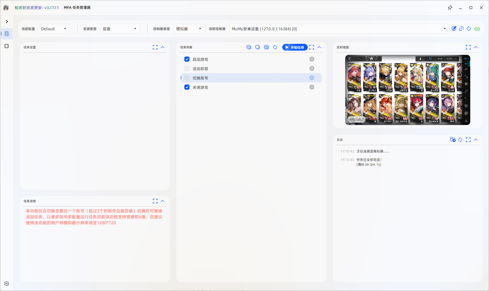

<!-- markdownlint-disable MD033 MD041 -->
<div align="center">

# MFAAvalonia

**🚀 Next-Generation Cross-Platform Automation Framework GUI**

_A universal GUI solution for [MaaFramework](https://github.com/MaaXYZ/MaaFramework) built
with [Avalonia UI](https://github.com/AvaloniaUI/Avalonia)_

[](./LICENSE)
[](https://dotnet.microsoft.com/)
[](https://github.com/SweetSmellFox/MFAAvalonia)
[](https://github.com/SweetSmellFox/MFAAvalonia/commits)
[](https://github.com/SweetSmellFox/MFAAvalonia/stargazers)
[](https://mirrorchyan.com/zh/projects?rid=MFAAvalonia&source=mfaagh-badge)

---

**English** | [简体中文](./README.md)

</div>

## ✨ Key Features

<table>
<tr>
<td width="50%">

### 🎨 Modern Interface

- Beautiful UI powered by **SukiUI**
- **Light/Dark** theme auto-switching
- Smooth animations and interactions</td>

<td width="50%">

### 🌍 True Cross-Platform

- Full support for **Windows** / **Linux** / **macOS**
- Native performance, no extra runtime needed
- Consistent user experience across platforms

</td>
</tr>
<tr>
<td width="50%">

### ⚡ Ready Out of the Box

- Deep integration with MaaFramework project templates
- Quick deployment with simple configuration
- One-click updates via Mirror Chyan

</td>
<td width="50%">

### 🔧 Highly Customizable

- Flexible task configuration system
- Multi-language internationalization support
- Rich extension interfaces

</td>
</tr>
</table>

## 📸 Preview

<p align="center">
  
</p>

## 📋 Requirements

|   Component   | Requirement                                    |
|:-------------:|:-----------------------------------------------|
|  **Runtime**  | .NET 10.0 or higher                            |
| **Resources** | A MaaFramework-based resource project          |
|  **System**   | Windows 10+, Linux (X11/Wayland), macOS 10.15+ |

## 🚀 Quick Start

### Option 1: Automatic Installation (Recommended)

MaaFramework project templates come with MFAAvalonia pre-configured.

### Option 2: Manual Installation

<details>
<summary><b>📦 Click to expand installation steps</b></summary>

1. **Download Release**
   Download the latest version from [Releases](https://github.com/SweetSmellFox/MFAAvalonia/releases) and extract

2. **Copy Resource Files**
   ```
   maafw/assets/resource/* → MFAAvalonia/resource/
   maafw/assets/interface.json → MFAAvalonia/
   ```

3. **Configure interface.json**
   Modify the `interface.json` file according to the configuration guide below</details>

## ⚙️ Configuration Guide

### Basic Configuration Structure

```jsonc
{
  // Project Information
  "name": "Project Name",
  "version": "1.0.0",
  "url": "https://github.com/{username}/{repository}",
  "custom_title": "Custom Window Title",
  
  // Mirror Chyan Update Configuration
  "mirrorchyan_rid": "Project ID",
  "mirrorchyan_multiplatform": false,
  
  // Resource Configuration
  "resource": [
    {
      "name": "Official",
      "path": "{PROJECT_DIR}/resource/base"
    },
    {
      "name": "Bilibili",
      "path": [
        "{PROJECT_DIR}/resource/base",
        "{PROJECT_DIR}/resource/bilibili"
      ]
    }
  ],
  
  // Task Configuration
  "task": [
    {
      "name": "Task Name",
      "entry": "Task Entry",
      "default_check": true,
      "description": "Task Documentation",
      "repeatable": true,
      "repeat_count": 1
    }
  ]
}
```

### Controller Configuration Details

`controller` is an array of objects for preset controllers:

| Field | Type | Description |
|:--|:--|:--|
| `name` | string | Unique identifier, used as controller ID |
| `label` | string | Display name, supports i18n (prefixed with `$`). Falls back to `name` |
| `description` | string | Detailed description, supports file path/URL/inline Markdown, supports i18n |
| `icon` | string | Icon path relative to project root, supports i18n |
| `type` | `'Adb' \| 'Win32' \| 'PlayCover'` | Controller type |
| `display_short_side` | number | Target short side, default 720. Mutually exclusive with `display_long_side` / `display_raw` |
| `display_long_side` | number | Target long side. Mutually exclusive with `display_short_side` / `display_raw` |
| `display_raw` | boolean | Use raw resolution. Mutually exclusive with scaled options |
| `adb` | object | Adb controller settings (input/screencap auto-detected in V2) |
| `win32` | object | Win32 controller settings |
| `playcover` | object | PlayCover controller settings (macOS only) |

`win32` fields:

| Field | Type | Description |
|:--|:--|:--|
| `class_regex` | string | Optional. Window class regex |
| `window_regex` | string | Optional. Window title regex |
| `mouse` | string | Optional. Mouse control method |
| `keyboard` | string | Optional. Keyboard control method |
| `screencap` | string | Optional. Screenshot method |

`playcover` fields:

| Field | Type | Description |
|:--|:--|:--|
| `uuid` | string | Optional. Target app bundle identifier, default `maa.playcover` |

### Task Configuration Details

#### External Notifications
- [External Notification Fill Guide](./docs/en/external-notification.md)

#### Custom Layout
- [Custom Layout Guide](./docs/en/custom-layout.md)

| Field           |  Type   | Default | Description                             |
|:----------------|:-------:|:-------:|:----------------------------------------|
| `name`          | string  |    -    | Task display name                       |
| `entry`         | string  |    -    | Task entry interface                    |
| `default_check` | boolean | `false` | Whether selected by default             |
| `description`   | string  | `null`  | Task documentation (supports rich text) |
| `repeatable`    | boolean | `false` | Whether task can be repeated            |
| `repeat_count`  | number  |   `1`   | Default repeat count                    |

### 📝 Rich Text Formatting

Task documentation (`doc`) supports the following formats:

- **Markdown** - Most standard syntax supported
- **HTML** - Partial tag support
- **Custom Tags** - Extended styling support

| Tag                       | Effect            | Example                       |
|:--------------------------|:------------------|:------------------------------|
| `[color:name]...[/color]` | Text color        | `[color:red]Red text[/color]` |
| `[b]...[/b]`              | **Bold**          | `[b]Bold text[/b]`            |
| `[i]...[/i]`              | *Italic*          | `[i]Italic text[/i]`          |
| `[u]...[/u]`              | <u>Underline</u>  | `[u]Underlined text[/u]`      |
| `[s]...[/s]`              | ~~Strikethrough~~ | `[s]Strikethrough text[/s]`   |

### 🎯 Focus Protocol

`focus` is used to output key tips, toast, or logs during task execution. Both **legacy** and **new** protocols are supported in a node:

- **Legacy**: fields `start / succeeded / failed / toast / aborted`
- **New**: keys are **message types**, values are string or string array

Message types follow MaaFramework node event constants, for example:
- Recognition: `Node.Recognition.Starting` / `Node.Recognition.Succeeded` / `Node.Recognition.Failed`
- Action: `Node.Action.Starting` / `Node.Action.Succeeded` / `Node.Action.Failed`

The new protocol matches by message type and renders to logs.

**Legacy example:**
```jsonc
{
  "focus": {
    "start": ["[color:cyan]Start[/color]"],
    "succeeded": ["[color:green]Done[/color]"],
    "failed": ["[color:red]Failed[/color]"],
    "toast": ["Title", "Content"],
    "aborted": true
  }
}
```

**Legacy field notes:**
- `toast`: shows a Toast when array length >= 1; item 1 is title, item 2 is content (optional)
- `aborted`: when `true`, triggers abort callback at `Starting` stage (used to interrupt task)

**New protocol example:**
```jsonc
{
  "focus": {
    "Node.Action.Starting": "Start: {name}",
    "Node.Action.Succeeded": "Done: {name}, [color:green]",
    "Node.Action.Failed": "Failed ID: {action_id}"
  }
}
```

**Placeholders & variables:**
- `{key}` is replaced from `details`
- Legacy logs/toast support counter variables like `{count}`, `{++count}`, `{count++}`, `{count+1}`

## 🧪 Advanced Features

### Advanced Field (Deprecated)

> [!TIP]
> The `Advanced` field has been largely replaced by input types in
> [InterfaceV2](https://github.com/MaaXYZ/MaaFramework/blob/main/docs/en_us/3.3-ProjectInterfaceV2.md), and is not recommended.

## 🛠️ Development Guide

### Multi-Language Support

Create a `lang` folder in the same directory as `interface.json` and add language files:

```
lang/
├── zh-cn.json  # Simplified Chinese
├── zh-tw.json  # Traditional Chinese
└── en-us.json  # English
```

Also add the multi-language field in `interface.json` (paths are relative to `interface.json`):

```jsonc
{
  "languages": {
    "zh-cn": "lang/zh-cn.json",
    "zh-tw": "lang/zh-tw.json",
    "en-us": "lang/en-us.json"
  }
}
```

Task names and documentation can use keys for reference, and MFAAvalonia will automatically load the corresponding
translations based on language settings.

### Announcement System

Place `.md` files in the `resource/announcement/` directory to display them as announcements. Changelog will be
automatically downloaded as an announcement when resources are updated.

### Launch Parameters

```bash
# Launch with specific configuration file
MFAAvalonia -c config-name
```

### Custom Icon

Place `logo.ico` in the program root directory to replace the window icon.

## 📄 License

This project is licensed under **[GPL-3.0 License](./LICENSE)**.

## 🙏 Acknowledgements

### Open Source Projects

| Project | Description |
|:---|:---|
| [**SukiUI**](https://github.com/kikipoulet/SukiUI) | Desktop UI Library for Avalonia |
| [**MaaFramework**](https://github.com/MaaAssistantArknights/MaaFramework) | Image Recognition Automation Framework |
| [**MaaFramework.Binding.CSharp**](https://github.com/MaaXYZ/MaaFramework.Binding.CSharp) | C# Binding for MaaFramework |
| [**Mirror Chyan**](https://github.com/MirrorChyan/docs) | Resource Update Service |
| [**Serilog**](https://github.com/serilog/serilog) | Structured Logging Library |
| [**Newtonsoft.Json**](https://github.com/JamesNK/Newtonsoft.Json) | High-performance JSON Serialization Library |
| [**AvaloniaExtensions.Axaml**](https://github.com/dotnet9/AvaloniaExtensions) | Syntax Sugar for Avalonia UI |
| [**CalcBindingAva**](https://github.com/netwww1/CalcBindingAva) | XAML Calculated Binding Extension |

### Contributors

Thanks to all developers who contributed to MFAAvalonia!

<a href="https://github.com/SweetSmellFox/MFAAvalonia/graphs/contributors">
  
</a>

<div align="center">

**If this project helps you, please give us a ⭐ Star!**

[](https://star-history.com/#SweetSmellFox/MFAAvalonia&Date)

</div> 


